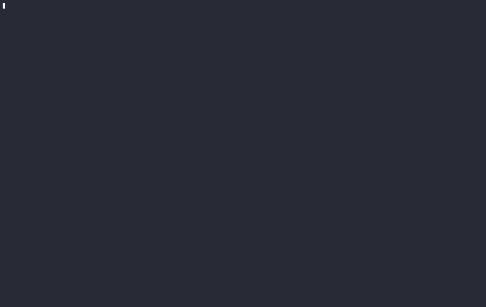

# Charty

A terminal-based stock market charting and analysis application built in Rust.



## Features

- **Historical Charts** — Line charts with SMA-20/SMA-50 overlay (`i`), volume bars (`v`), and five timeframes (1D / 1W / 1M / 3M / 1Y)
- **Live Streaming** — Real-time price ticker and live candlestick aggregation via Finnhub WebSocket
- **Market Overview** — Top gainers, losers, and most-active stocks
- **Watchlist** — Persist a personal list of symbols across sessions
- **Price Alerts** — Notify when a stock crosses a target price (desktop notification via `notify-send`)
- **Stock Search** — Look up any symbol by ticker

## Prerequisites

- Rust toolchain ([rustup.rs](https://rustup.rs/))
- Finnhub API key — only required for **Live mode** ([finnhub.io](https://finnhub.io/))

## Installation

```bash
git clone https://github.com/cyoger/charty
cd charty
cargo build --release
```

## Configuration

Live mode uses Finnhub WebSocket. Create a `.env` file in the project root:

```
FINNHUB_API_KEY=your_api_key_here
```

All other features (historical charts, quotes, market overview) use Yahoo Finance and require no API key.

## Usage

```bash
cargo run --release
# or after building:
./target/release/charty
```

## Keyboard Controls

**Landing Page**
| Key | Action |
|-----|--------|
| `↑ / ↓` | Navigate list |
| `Enter` | Open chart for selected stock |
| `Tab` | Switch between Popular / Watchlist panels |
| `s` | Search for a symbol |
| `m` | Market overview |
| `r` | Refresh quotes |
| `a` | Set / clear price alert on selected stock |
| `d` | Remove selected stock from watchlist |
| `h` | Help |
| `q` | Quit |

**Chart View**
| Key | Action |
|-----|--------|
| `← / →` | Change timeframe |
| `v` | Toggle volume bars |
| `i` | Toggle SMA-20 / SMA-50 indicators |
| `l` | Enter live mode |
| `w` | Add current stock to watchlist |
| `a` | Set / clear price alert |
| `r` | Refresh data |
| `s` | Search for a new symbol |
| `b` | Back to landing |
| `e` | Toggle error log |
| `h` | Help |
| `q` | Quit |

**Live Mode**
| Key | Action |
|-----|--------|
| `1` | Switch to Live Ticker |
| `2` | Switch to Live Candles |
| `← / →` | Change candle interval (Live Candles only) |
| `l` | Switch live mode |
| `a` | Set / clear price alert |
| `b` | Back to chart |
| `e` | Toggle error log |
| `h` | Help |
| `q` | Quit |

**Market Overview**
| Key | Action |
|-----|--------|
| `↑ / ↓` | Navigate list |
| `Tab` | Switch between Gainers / Losers / Active |
| `Enter` | Open chart for selected stock |
| `r` | Refresh |
| `b / Esc` | Back to landing |
| `q` | Quit |

## Project Structure

```
src/
├── main.rs        # Event loop and async task coordination
├── stock.rs       # Yahoo Finance data fetching (quotes, charts, market movers)
├── websocket.rs   # Finnhub WebSocket live price streaming
├── alerts.rs      # Price alert persistence
├── watchlist.rs   # Watchlist persistence
└── ui/
    ├── mod.rs     # App state and core logic
    ├── chart.rs   # Historical chart, volume bars, SMA rendering
    ├── live.rs    # Live ticker and live candle rendering
    ├── landing.rs # Landing page rendering
    └── market.rs  # Market overview rendering
```

## License

MIT
